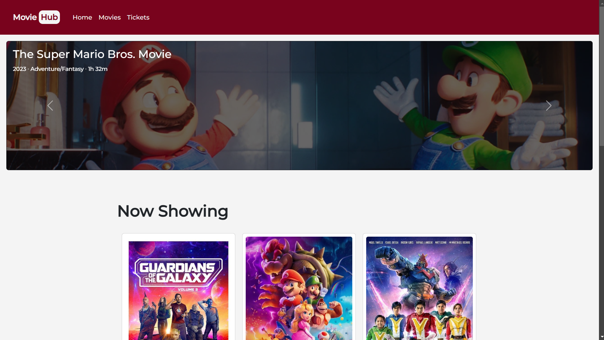

# Online Movie Ticketing Website

## Overview  
This project is a web-based application designed to provide a seamless experience for booking movie tickets online. Users can browse currently showing movies, select their preferred showtime, and complete their booking with a detailed summary.

## Features  
- Responsive design using Bootstrap for a modern UI  
- Displays currently showing movies with details  
- Allows users to book tickets and view booking summaries  
- User-friendly interface for a smooth booking process  

## About the Project  
This project was developed in **2023** during my second year of college for the subject *Integrative Programming 1*. It was created to enhance my understanding of web development.

